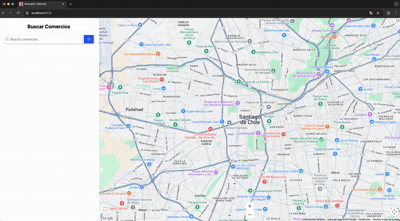

# Business Search Application

## Objetivo

Desarrollar una aplicación web que permita a los usuarios buscar y visualizar comercios en un mapa interactivo, similar a Google Maps.

## Requisitos Funcionales

### Interfaz de Usuario (UI)

- ✅ Crear una barra de búsqueda donde los usuarios puedan ingresar el nombre o tipo de comercio.
- ✅ Mostrar una lista de resultados de búsqueda debajo de la barra de búsqueda.
- ✅ Integrar un mapa interactivo que muestre la ubicación de los comercios.

### Funcionalidad de Búsqueda

- ✅ Permitir al usuario hacer clic en un marcador para ver más detalles sobre el comercio.

### Detalles del Comercio

- ✅ Mostrar información detallada del comercio seleccionado, como nombre, dirección, horario de atención y una imagen.

## Entregables

- Código fuente de la aplicación en un repositorio de GitHub.
- Instrucciones claras sobre cómo ejecutar la aplicación localmente.
- Un archivo README detallado que explique la arquitectura de la aplicación, las decisiones de diseño y cualquier otra información relevante.

## Criterios de Evaluación

- **Funcionalidad**: La aplicación cumple con todos los requisitos funcionales.

## Supuestos

- Para traer los comercios solo se debe utilizar el buscador de comercios, no se traer datos de inmediato.
- Los datos de los comercios se obtienen desde un mock.
- No se implementó backend ni base de datos para simplificar el desarrollo.
- Los tipos de comercio estarán limitados a categorías ficticias como: supermercado, café, restaurante y farmacia, representando los rubros más comunes.
- No se considera la localización del usuario, por lo que se muestra el mapa desde la ubicación de la primera búsqueda.
- **La aplicación solo funciona en modo desarrollo** ya que Mock Service Worker (MSW) está configurado únicamente para este entorno. Esta decisión se tomó para simplificar el desarrollo y demostración de la aplicación.

## Decisiones de Diseño

La interfaz de usuario de la aplicación se diseñó siguiendo un enfoque intuitivo y fácil de usar, inspirado en aplicaciones populares de búsqueda como Google Maps. Las principales decisiones de diseño incluyen:

### Diseño de Escritorio

- **Sidebar con Buscador**: Se implementó un sidebar en el lado izquierdo de la pantalla que contiene el buscador en la parte superior y los resultados de búsqueda debajo, permitiendo a los usuarios ver rápidamente todos los comercios encontrados.

- **Mapa Interactivo**: En el lado derecho de la pantalla se muestra un mapa de Google Maps con marcadores para cada comercio encontrado, ofreciendo una representación visual de las ubicaciones.

- **Tarjetas de Comercios**: Los resultados de búsqueda se muestran como tarjetas con información básica (nombre, dirección, tipo), permitiendo al usuario seleccionar un comercio haciendo clic en la tarjeta.

- **Destacado Visual**: El comercio seleccionado se destaca visualmente tanto en la lista (con un borde de color) como en el mapa (centrando la vista en el marcador).

- **Popover de Información**: Al hacer clic en un marcador del mapa, se muestra un popover con información detallada del comercio, incluyendo nombre, dirección, horarios e imagen, lo que permite al usuario obtener más información sin cambiar de pantalla.

### Diseño Responsive

- **Enfoque Mobile-First**: En dispositivos móviles, se prioriza la visualización del mapa, ocupando toda la pantalla para maximizar la experiencia de navegación.

- **Buscador Flotante**: El buscador se muestra como un elemento flotante en la parte superior de la pantalla, permitiendo realizar búsquedas sin perder de vista el mapa.

- **Interacción Simplificada**: En móviles, para ver la información detallada de un comercio, el usuario debe hacer clic en el marcador correspondiente en el mapa, lo que muestra el popover con toda la información relevante.

- **Controles de Mapa Optimizados**: Los controles del mapa (zoom, pantalla completa) se han posicionado estratégicamente para evitar superposiciones con otros elementos de la interfaz y garantizar su accesibilidad en todos los dispositivos.

Estas decisiones de diseño proporcionan varias ventajas:

- **Usabilidad Mejorada**: La interfaz es intuitiva y fácil de usar tanto en dispositivos de escritorio como móviles.
- **Experiencia Fluida**: Los usuarios pueden buscar, explorar y obtener información detallada de los comercios sin cambios de página o interrupciones.
- **Adaptabilidad**: La aplicación se adapta a diferentes tamaños de pantalla, ofreciendo una experiencia óptima en cada dispositivo.
- **Eficiencia Visual**: La disposición de los elementos maximiza el espacio disponible y presenta la información de manera clara y organizada.


## Arquitectura del Proyecto

El proyecto sigue una arquitectura modular basada en componentes, con una clara separación de responsabilidades. La estructura del proyecto se organiza de la siguiente manera:

```
src/
├── assets/            # Recursos estáticos como imágenes, iconos, etc.
├── components/        # Componentes reutilizables de React
├── config/            # Configuraciones globales de la aplicación
├── mocks/             # Configuración de Mock Service Worker
│   ├── data/          # Datos mock para simular respuestas de API
│   ├── handlers/      # Manejadores de peticiones HTTP mock
│   └── interfaces/    # Interfaces TypeScript para los datos mock
├── pages/             # Páginas de la aplicación (componentes de nivel superior que representan rutas completas)
│   └── SearchPage.tsx # Página principal de búsqueda con mapa y listado de comercios
└── shared/            # Código compartido entre diferentes partes de la aplicación
    ├── constants/     # Constantes utilizadas en toda la aplicación
    ├── context/       # Contextos de React para estado global
    ├── hooks/         # Hooks personalizados de React
    └── services/      # Servicios para interactuar con APIs externas
```

Esta arquitectura permite:

- **Modularidad**: Cada componente tiene una responsabilidad única y bien definida.
- **Reutilización**: Los componentes, hooks y servicios pueden ser reutilizados en diferentes partes de la aplicación.
- **Mantenibilidad**: La separación clara de responsabilidades facilita el mantenimiento y la evolución del código.
- **Testabilidad**: La estructura modular facilita la escritura de pruebas unitarias y de integración.

### Patrones de Diseño Utilizados

- **Context API**: Para gestionar el estado global de la aplicación, como el negocio seleccionado.
- **Custom Hooks**: Para encapsular lógica reutilizable, como la búsqueda de negocios.
- **Mocks**: Para simular una API durante el desarrollo, permitiendo trabajar sin dependencias externas.
- **Arquitectura basada en páginas**: Separación de la aplicación en componentes de nivel superior (páginas) que representan rutas completas, mejorando la organización y mantenibilidad del código.
- **Cliente HTTP centralizado**: Utilización de Axios con una configuración centralizada que incluye interceptores para manejo de errores y métodos específicos para diferentes tipos de peticiones HTTP.

## Tecnologías Utilizadas

- React
- Mock Service Worker
- Vite
- Tailwind CSS
- React Google Maps Api
- React Query
- TypeScript
- Lucide React
- ESLint
- Playwright
- Axios


## Requisitos Previos

- [Node.js](https://nodejs.org/): `v22.12.0`  
    Recomendamos usar **NVM** (Node Version Manager) para manejar múltiples versiones de Node.js en tu sistema.  

    **Usando NVMM**:

    Si tienes **NVM** instalado, puedes asegurarte de estar usando la versión correcta de Node.js especificada en el archivo `.nvmrc` del proyecto. Simplemente ejecuta:  

    ```bash
    nvm use
    ```

    Si no tienes NVM instalado, puedes hacerlo siguiendo las instrucciones de su [repositorio oficial](https://github.com/nvm-sh/nvm).

- [pnpm](https://pnpm.io/): Asegúrate de tener pnpm instalado globalmente. Puedes hacerlo con el siguiente comando:

    ```bash
    npm install -g pnpm
    ```

## Instalación y Ejecución del Proyecto

Hay dos formas de ejecutar este proyecto: localmente o con Docker.

### Instalación y Ejecución Local

1. Clonar el Repositorio
    Clona el repositorio en tu máquina local usando el siguiente comando:

    ```bash
    git clone git@github.com:orlando-abm/search-coding-challenge.git
    ```

2. Instala las dependencias:
    Una vez que hayas clonado el repositorio, navega al directorio del proyecto y asegúrate de estar usando la versión correcta de Node.js, una vez que estés en el directorio del proyecto, ejecuta el siguiente comando:

    ```bash
    nvm use
    ```

    **Nota**: El comando nvm use asegurará que estés usando la versión de Node.js especificada en el archivo .nvmrc. Si no tienes NVM instalado, puedes hacerlo siguiendo las instrucciones de su [repositorio oficial](https://github.com/nvm-sh/nvm).

    Luego, instala las dependencias utilizando pnpm:

    ```bash
    pnpm install
    ```

    **Nota**: Si no tienes pnpm instalado, instálalo con el siguiente comando

    ```bash
    npm install -g pnpm
    ```
    
3. Configuración del Entorno
    Configura las variables de entorno necesarias para el proyecto. Crea un archivo .env basado en el archivo .env.example:

    ```bash
    cp .env.example .env
    ```

    A continuación, edita el archivo .env, agregando la API_KEY de Google Maps en GOOGLE_MAPS_KEY y la URL de este proyecto en API_URL, por defecto es http://localhost:5173, en caso de que el proyecto se ejecute en un puerto diferente, debes modificar el valor de API_URL.

4. Ejecución del Proyecto
    Una vez que hayas configurado las variables de entorno, puedes ejecutar el proyecto con el siguiente comando:

    ```bash
    pnpm run dev
    ```

### Instalación y Ejecución con Docker

Si prefieres utilizar Docker, puedes seguir estos pasos:

1. Clonar el Repositorio
    Clona el repositorio en tu máquina local usando el siguiente comando:

    ```bash
    git clone git@github.com:orlando-abm/search-coding-challenge.git
    ```

2. Configuración del Entorno
    Configura las variables de entorno necesarias para el proyecto. Crea un archivo .env basado en el archivo .env.example:

    ```bash
    cp .env.example .env
    ```

    A continuación, edita el archivo .env, agregando la API_KEY de Google Maps en GOOGLE_MAPS_KEY y la URL de este proyecto en API_URL, por defecto es http://localhost:5173.

3. Construir y Ejecutar con Docker
    Construye la imagen de Docker y ejecuta el contenedor con los siguientes comandos:

    ```bash
    # Construir la imagen
    docker build -t search-app .
    
    # Ejecutar el contenedor
    docker run -p 5173:5173 --env-file .env search-app
    ```

    Esto iniciará la aplicación en modo desarrollo y estará disponible en http://localhost:5173.

## Nota Importante: Modo Desarrollo

**Esta aplicación está diseñada para funcionar exclusivamente en modo desarrollo**, ya que utiliza Mock Service Worker (MSW) para simular las respuestas de API. MSW está configurado únicamente para el entorno de desarrollo, lo que permite simular las respuestas del servidor sin necesidad de un backend real.

Esta decisión se tomó para simplificar el desarrollo y demostración de la aplicación, permitiendo que funcione de manera autónoma sin dependencias externas.

## Tests

El proyecto incluye tests automatizados utilizando Playwright para verificar la funcionalidad principal de la aplicación. Los tests están ubicados en el directorio `tests/` y cubren los siguientes escenarios:

### Tests de Búsqueda

- **search-results.spec.ts**: Verifica que al buscar "café" se muestren exactamente 5 resultados en la lista de comercios.

### Tests de Interacción con el Mapa

- **map-interaction.spec.ts**: Verifica la interacción con los marcadores de Google Maps y la visualización de la ventana de información al hacer clic en un marcador. Este test busca "Café Wonderful", hace clic en un marcador del mapa y verifica que se muestre la ventana de información con los detalles del comercio.

### Ejecución de Tests

Para ejecutar los tests, utiliza los siguientes comandos:

```bash
# Ejecutar todos los tests
pnpm test

# Ejecutar tests en modo visual (con navegador visible)
pnpm test:headed

# Ver el reporte de los tests
pnpm show:report
```

Para ejecutar un test específico:

```bash
pnpm test:search-results
pnpm test:map-interaction
```

## Demostración


